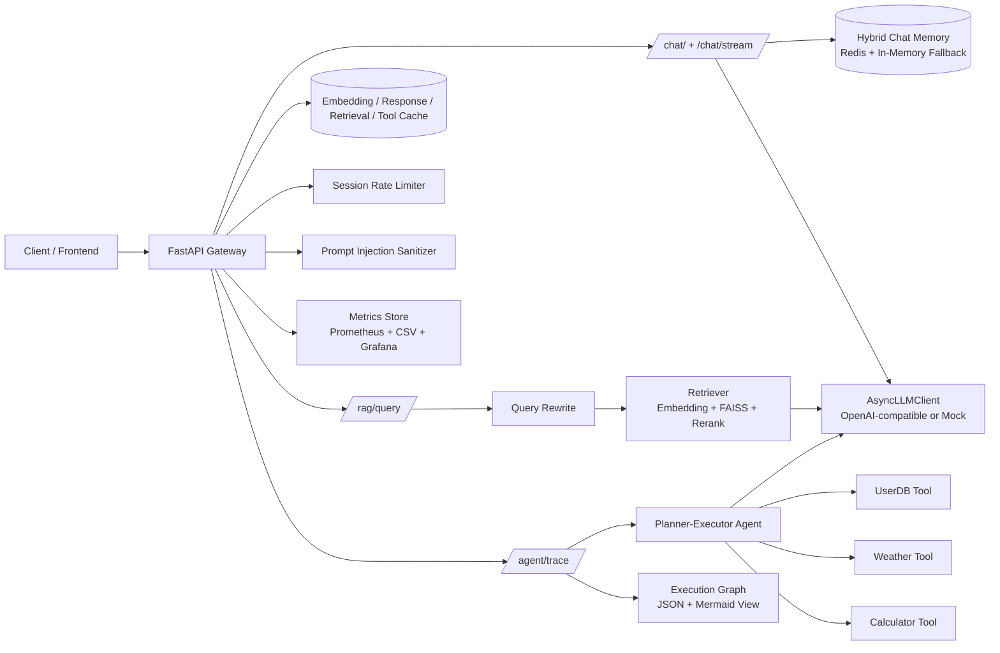

# Agentic RAG Platform

一个面向**工程实战**的 Agentic RAG 项目：不仅覆盖 RAG 问答，还包含 Agent 工具链、可观测性、缓存、限流与可解释执行图。

---

## 1. 项目价值

> 一个可生产演进的 RAG 后端骨架：从“能回答”升级到“可观测、可解释、可优化、可运维”。

- **完整链路**：query → rewrite（可选）→ retrieval → prompt 组装 → LLM 输出。
- **工程能力**：统一错误处理、会话记忆、缓存、限流、metrics、压测脚本。
- **可解释性**：Agent trace（图结构 + 可视化）支持排障与复盘。

---

## 2. 核心能力总览

### 基础 API

- `GET /ping`：健康检查
- `POST /chat`：多轮会话问答（含 Redis history）
- `POST /chat/stream`：SSE 流式输出（token / usage 事件）

### RAG API

- `POST /rag/query`：检索增强问答（支持 query rewrite、top-k）

### Agent API

- `POST /agent/trace`：执行 Planner-Executor 并返回 trace
- `GET /agent/trace/{trace_id}`：读取 trace 数据
- `GET /agent/trace/{trace_id}/view`：Mermaid HTML 可视化

### 观测与运维

- `GET /metrics`：Prometheus 文本指标
- `reports/metrics_events.csv`：请求级事件落盘
- Grafana Dashboard：TTFT、P95、Cache Hit 等

---

## 3. 系统架构



**关键实现亮点**

- 统一入口与观测：request-id、耗时、状态码、TTFT、token、cache 命中。
- RAG 可追溯：返回 `sources/doc_ids`，支持检索重排与 query rewrite。
- Agent 可解释：plan + tool observations + trace graph。
- 工程护栏：多层缓存 + 会话限流 + prompt 注入防护。

---

## 4. 快速开始

### 4.1 Docker（推荐）

```bash
docker compose up --build
```

启动后：

- API: `http://127.0.0.1:8000`
- Prometheus: `http://127.0.0.1:9090`
- Grafana: `http://127.0.0.1:3000`（`admin/admin`）

停止：

```bash
docker compose down
```

### 4.2 本机开发

安装依赖：

```bash
pip install -r requirements.txt
```

启动 Redis：

```bash
docker run -d --name agentic-rag-platform-redis -p 6379:6379 redis:7
# 如果已存在：docker start agentic-rag-platform-redis
```

配置 LLM：

```bash
# 真实 LLM（可选）
export OPENAI_API_KEY="your_api_key"
export OPENAI_MODEL="gpt-4.1-mini"
# export OPENAI_API_BASE="https://api.openai.com/v1"

# Mock 模式（无 key 时默认自动启用；也可显式开启）
export MOCK_LLM=true
```

启动服务：

```bash
uvicorn app.main:app --reload
```

---

## 5. 演示脚本

### Step 1：系统全览（架构 + 能力）

- 说明该项目同时覆盖 RAG、Agent、可观测性、缓存与限流。
- 打开 Grafana 与 `/agent/trace/{trace_id}/view` 展示“可观测 + 可解释”。

### Step 2：API 基线演示（鲁棒性 + 多轮会话）

```bash
curl -i http://127.0.0.1:8000/ping

curl -i -X POST http://127.0.0.1:8000/chat \
  -H 'Content-Type: application/json' \
  -d '{"message":"hello","session_id":"s1"}'
```

重点强调：统一错误格式、history 持久化、多轮上下文。

### Step 3：RAG 链路演示（检索增强）

```bash
python -m app.retrieval.build_index
python -m app.retrieval.evaluate_rag_quality

curl -X POST http://127.0.0.1:8000/rag/query \
  -H 'Content-Type: application/json' \
  -d '{"query":"What is FAISS?","session_id":"rag-demo-1","k":5,"rewrite_query":true}'
```

重点强调：返回 `answer + sources/doc_ids`，并支持 rewrite_query。

### Step 4：性能与稳定性（缓存 + 指标 + 周报）

```bash
curl http://127.0.0.1:8000/metrics

python scripts/weekly_metrics_report.py \
  --input reports/metrics_events.csv \
  --output reports/weekly_metrics_report.csv
```

### Step 5：Agent 可解释性演示（Trace）

```bash
curl -X POST http://127.0.0.1:8000/agent/trace \
  -H 'Content-Type: application/json' \
  -d '{"question":"请先查 users 资料，再告诉我 Alice 所在城市天气，并计算 7 * 3 + 2，最后整理成结论。"}'
```

拿到 `trace_id` 后：

```bash
curl http://127.0.0.1:8000/agent/trace/<trace_id>
# 浏览器打开: http://127.0.0.1:8000/agent/trace/<trace_id>/view
```

---

## 6. 关键指标与 Trade-offs

### 关键指标

- 接口可用性：关键端点检查通过，综合 `pass=true`
- 压测（`/chat`, 并发 100, 1000 请求）：
    - Success: **1000/1000**
    - P50: **207.67 ms**
    - P95: **378.12 ms**
    - QPS: **416.81**
- RAG 评估：
    - Retrieval precision: **100%**
    - Answer accuracy: **33.33%**
- KV Cache 分段：Prefill **74.02%** / Decode **25.98%**

### Trade-offs

- **检索命中 vs 回答准确**：先“找得到”，再通过 prompt/引用约束提升“答得对”。
- **复杂度 vs 可运营性**：引入 trace/metrics/cache/限流增加复杂度，但显著提升可诊断性。

---

## 7. 后续改进计划（Roadmap）

- **中期**：强化 RAG 生成约束（引用、拒答、结构化输出），提升 answer accuracy。
- **中期并行**：上下文裁剪 + 会话摘要 + prompt 压缩，降低 prefill 成本与 TTFT。

---

## 8. FAQ

**Q1：为什么要做 Agentic RAG，而不是纯 RAG？**  
A：纯 RAG 主要解决“检索+生成”；Agentic RAG 进一步解决多工具规划执行，并提供 trace 可解释能力，更接近生产需求。

**Q2：怎么保证线上稳定性？**  
A：统一错误处理、会话限流、缓存分层、请求级 metrics、Prometheus + Grafana、周期性报告。

**Q3：如何证明优化有效？**  
A：用 TTFT/P95/命中率等指标做前后对比，持续留痕到报告文件。

**Q4：为什么 retrieval precision 100%，answer accuracy 仍只有 33.33%？**  
A：检索层能“找得到”，但生成层仍可能出现引用不充分或归纳偏差；下一步通过引用约束、拒答策略、结构化输出解决。

**Q5：为什么要做 Agent trace，可不可以只返回答案？**  
A：只返回答案不利于排障；trace 能展示步骤、工具调用和中间结果，便于审计、复盘和优化。

---

## 9. 项目结构

```text
app/
  main.py                     # API 路由、异常处理、middleware、指标埋点
  llm_client.py               # LLM 调用封装（真实/Mock）
  memory/chat_store.py        # Redis 会话记忆
  retrieval/                  # 索引构建、检索、评估
  optimization/               # 缓存、限流
  langchain_tools/            # 工具注册、Agent、执行图
scripts/                      # 压测与报表脚本
monitoring/                   # Prometheus + Grafana 配置
tests/                        # pytest 测试集
```

---

## 10. License

[MIT](LICENSE)
