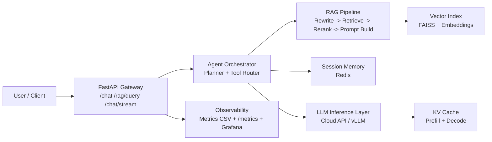

# Day 26｜项目演示材料（1页PPT）

## 标题：Agentic RAG Platform —— 架构、指标与演进路线

### 1) 系统架构图（讲解目标：30~45秒）

**一句话说明**：这是一个“Agent 负责决策 + RAG 负责找准知识 + KV Cache 负责加速推理 + 监控负责闭环优化”的在线问答系统。

---

### 2) 关键实现（讲解目标：90秒）

- **RAG（检索增强）**
  - 流程：`Query Rewrite -> Top-k 检索 -> rerank -> 拼接 context + history -> LLM 生成`。
  - 效果：离线评测中 `retrieval_precision = 100%`，说明“能找到相关材料”；但 `answer_accuracy = 33.33%`，说明“回答组织和约束”还有改进空间。

- **Agent（编排与工具调用）**
  - 通过 Planner/Executor 将“检索、历史、工具”组织成可控执行路径。
  - 在高并发场景引入 `bounded queue + worker pool + backpressure`，将错误率从 **98.80%** 降至 **0.00%**。

- **KV Cache（推理加速）**
  - 明确拆分 `Prefill` 与 `Decode`：先把历史上下文写入 K/V，再进行逐 token 生成。
  - 实验结果显示 Prefill 时间占比约 **74%**，验证“长上下文主要拖慢 TTFT”的工程直觉。

---

### 3) 关键指标（TTFT / P95 / Cost）（讲解目标：90秒）

> 建议在 PPT 中做成“三栏对比卡片”：体验、稳定性、成本。

- **TTFT（首 token 延迟）**
  - 短 prompt：平均 **6301.63 ms**
  - 长 prompt：平均 **11880.14 ms**
  - 结论：长上下文显著增加首字等待，需持续优化 Prefill。

- **P95（尾延迟）**
  - 并发 100（改进后）：P95 = **435.45 ms**，错误率 **0.00%**。
  - 并发 50（方案对比）：
    - cloud_api：P95 = **1652.30 ms**
    - vllm_batching：P95 = **9386.36 ms**
    - hf_single_process：P95 = **71066.93 ms**

- **Cost（单位成本）**
  - cloud_api：**0.2727 USD / 1k req**（延迟优）
  - vllm_batching：**0.0761 USD / 1k req**（成本优）
  - hf_single_process：**0.4913 USD / 1k req**（不适合高并发生产）

---

### 4) Tradeoffs（取舍）+ 后续改进计划（讲解目标：60秒）

- **Tradeoff A：低延迟 vs 低成本**
  - cloud_api 延迟更好，但单次请求成本更高。
  - vLLM batching 成本最优，但排队与批窗口会拉高尾延迟。

- **Tradeoff B：召回率 vs 回答准确率**
  - 检索命中高，不代表最终回答一定准确；需要回答阶段的约束与验证。

- **Tradeoff C：吞吐提升 vs 系统复杂度**
  - 队列/背压/多 worker 提升稳定性，但带来调参与运维复杂度。

**下一阶段（2~4周）**
1. **TTFT 优化**：Prompt 压缩 + 缓存复用策略 + 更激进的 KV/会话裁剪。
2. **准确率优化**：结构化输出、引用强约束、RAG 结果自检（拒答/降级）。
3. **成本治理**：按请求类型智能路由（低价值请求走低成本模型，高价值请求走高质量模型）。

---

### 5) 5分钟讲解节奏（可直接照读）

1. **0:00-0:45**：先看架构图，说明 4 层：接入层、Agent/RAG、推理层、监控层。  
2. **0:45-2:15**：讲 3 个关键实现：RAG、Agent 并发治理、KV Cache。  
3. **2:15-3:45**：看三大指标：TTFT、P95、Cost，并点明“为什么会这样”。  
4. **3:45-4:30**：讲 tradeoff（延迟/成本、召回/准确率、吞吐/复杂度）。  
5. **4:30-5:00**：讲改进路线和可预期收益。

---

## 附：3 个常见问答（Q&A 备答）

**Q1：为什么检索命中率 100%，回答准确率却只有 33.33%？**  
A：命中率高说明“找到了相关材料”，但回答准确率还受 prompt 约束、证据引用方式、答案生成策略影响。下一步会加“结构化输出 + 强制引用 + 不确定时拒答”的策略来提升最终正确率。

**Q2：为什么不全量迁移到 vLLM batching，成本不是最低吗？**  
A：vLLM 在单位成本上最优，但当前尾延迟较高；如果业务目标是交互体验优先（如客服实时对话），需要保留 cloud_api 路径。实际会采用“按请求分层路由”的混合架构。

**Q3：TTFT 现在还是秒级，短期最有效的优化点是什么？**  
A：短期最有效的是降低 Prefill 负担：压缩历史上下文、减少无效 tokens、提高缓存命中；中期再做模型路由和更细粒度的 KV 复用，通常能带来更稳定的首字延迟改善。
